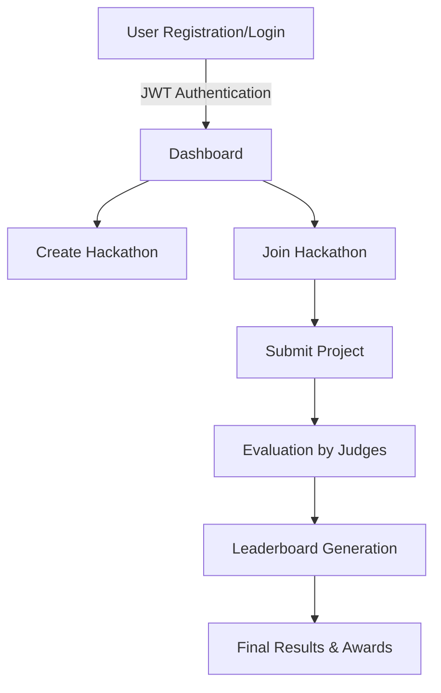

# Hackalyze - Code To Give 2025

## 🚀 Project Overview
Hackalyze is designed to streamline the **hackathon management** process, making it easier for organizers, participants, and judges to collaborate efficiently.

## Problem Statement
Evaluating student ideas at scale is challenging, especially when submissions are **unstructured and lack clarity**. 
Teachers also struggle with conducting **personalized assessments** in classrooms, making it difficult to gauge student understanding and provide targeted feedback.

## 📌 Features
- **Hackathon Creation & Management**
- **Team Registration & Collaboration**
- **Project Submission & Evaluation**
- **Leaderboard & Performance Analytics**
- **Mentorship & Support Integration**
- **Automated Judging & Results Calculation**

---

## 🛠 Tech Stack
The project utilizes modern technologies to ensure scalability, performance, and security:

### **Frontend:**
- **React.js** – For an interactive UI
- **Tailwind CSS** – For rapid styling

### **Backend:**
- **Node.js & Express.js** – Server-side logic
- **MongoDB** – NoSQL database for storing user and hackathon data

### **Authentication & Security:**
- **JWT (JSON Web Token)** – Secure authentication
- **Bcrypt.js** – Password encryption

### **Deployment & Hosting:**
- **Vercel / Netlify** – Frontend hosting
- **AWS / DigitalOcean** – Backend & Database hosting

---

## 🔄 Workflow & Architecture
Hackalyze follows a **microservices-based modular architecture**:

1. **User Authentication** – Secure login and registration
2. **Hackathon Setup** – Organizers create and configure events
3. **Team Formation & Project Submission** – Participants collaborate and submit projects
4. **Judging & Evaluation** – Judges assess projects based on predefined criteria
5. **Leaderboard & Insights** – Real-time leaderboard updates

### 📌 **Flowchart Representation**


---

## 🛠 Installation & Setup
Follow these steps to set up Hackalyze locally:

### **1️⃣ Clone the Repository**
```sh
git clone https://github.com/your-repo/Hackalyze.git
cd Hackalyze
```

### **2️⃣ Install Dependencies**
```sh
npm install  # Install dependencies for frontend & backend
```

### **3️⃣ Set Up Environment Variables**
Create a `.env` file in the backend directory:
```sh
MONGO_URI=your_mongodb_connection
JWT_SECRET=your_secret_key
```

### **4️⃣ Start Development Server**
```sh
npm run dev
```

---

## 🎥 Demo & Screenshots
_(Add video clips or images here)_

---

## 🎯 Future Enhancements

- 🤖 **AI Evaluation** – Automated project assessment  
- 🔗 **Blockchain Voting** – Secure and transparent voting system  
- 💬 **Real-time Chat & Video** – Seamless mentoring and collaboration  
- 🎓 **AI Student Assistance** – Smart guidance for participants  
- 📧 **Enhanced Email Support** – Faster and structured responses  
- 📱 **Mobile Optimization** – Improved accessibility on all devices  
- 📝 **AI Feedback Analysis** – Intelligent insights for better learning  
- 📂 **Advanced File Management** – Efficient sharing and organization  
- 🔊 **Auto Problem Statement Summary** – AI-driven summarization & reading  

---

## 🤝 Contributors
- Yash Arya
- Vaishnavi Tiwari
-  Samudraneel Sarkar
-  Akriti Gaur
-  Trishita Kesarwani
-  Kratika Bhadauria

---


